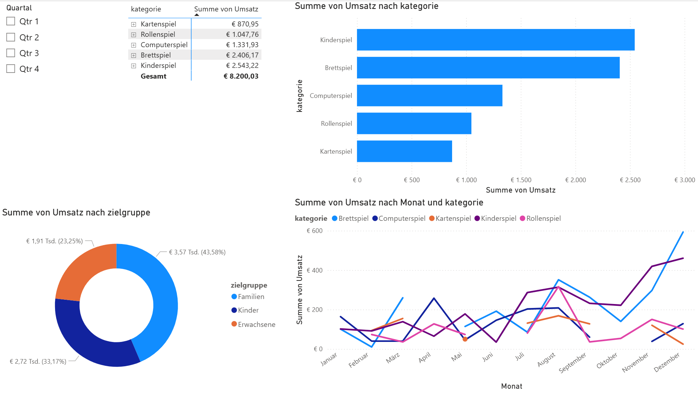
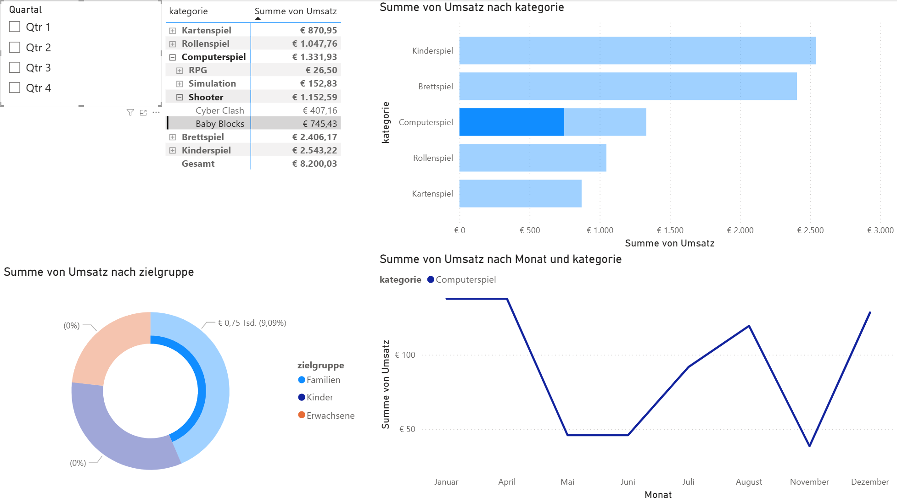
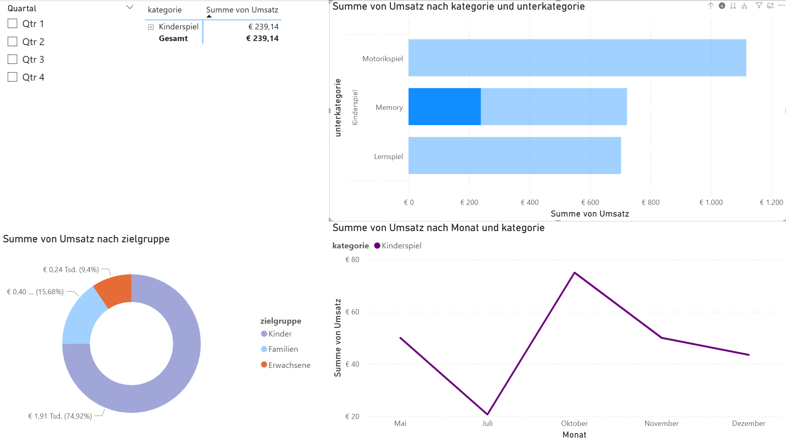

# Power BI Sales Dashboard

This repository contains a simple data analysis dashboard created with Microsoft Power BI.

## Project Overview

The goal of this project is to explore and visualize sales data using interactive dashboards.
The dashboard provides insights into sales performance across different regions, products, and time periods.

## Features

* Revenue analysis
* Regional sales comparison
* Product performance insights
* Interactive filters and visualizations

## Tools Used

* Microsoft Power BI
* Excel
* Data Visualization
* Data Modeling

## Dataset

The dataset used in this project is an Excel file containing sample sales data.

## Dashboard Preview

### Overview



### Filters and Interactions



### Sales Chart



## How to Open the Project

1. Download the `.pbix` file from this repository
2. Open it with Power BI Desktop
3. Explore the interactive dashboard

## Repository Structure

```
PowerBI_Sales_Dashboard
│
├── data
│   └── sales_data.xlsx
│
├── dashboard
│   └── sales_dashboard.pbix
│
├── images
│   ├── overview.png
│   ├── filters.png
│   └── chart.png
│
└── README.md
```

